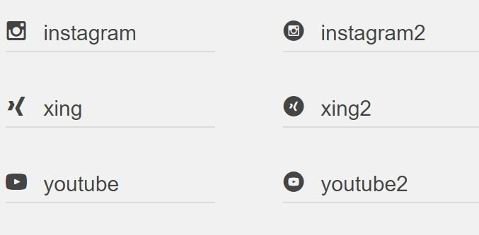

# tinectswfontaddition
adds ability to use more social-icons in shopware. these icons are using same font as it shopware does:

##Classes:
- icon--instagram
- icon--instagram2
- icon--xing
- icon--xing2
- icon--youtube
- icon--youtube2

Following the PR to got them implemented in shopware-font to avoid using this plugin. Please free to vote. [Pull Request at shopware/shopware](https://github.com/shopware/shopware/pull/1540)

## [Buy me a coffee](https://www.paypal.me/tinect/)